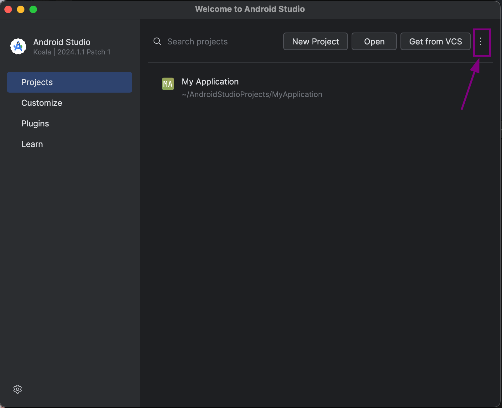

# How to disable SSL pinning device-wide on emulator

1. Create a new non-production emulator using Android Studio
    - Open Android Studio and Virtual device manager
        
        
        
    - Create a new emulator
        
        
        
    - Select any hardware profile which doesn’t have Play Store in it
        
        
        
    - Select the system image you wanna install
        
        
        
        > Chose system image with API ≤ 33. This method doesn’t support images with API ≥34.
        > 
    - Name the AVD and finish the process
        
        
        
2. Run the emulator with writable system using **Terminal**
    - Run the command to list the all avds and copy the name of avd which you created in the last steps
        
        ```bash
        emulator -list-avds
        ```
        
        
        
    - Run this command to start the emulator with writable system flag
        
        ```bash
        emulator -avd <YOUR_AVD_NAME_HERE> -writable-system
        ```
        
        
        
    - The emulator will boot up
        
        
        
        > Don’t close the emulator or the terminal which is running it.
        > 
        
3. Generate Charles CA cert
    - Open Charles and go to **Help menu**
        
        
        
    - Save the Charles ca cert in the repo with .PEM format
        
        
        
        
        
    - In the terminal, CD into the repo directory and run these commands
        
        ```bash
        chmod +x generateCertificate.sh
        ./generateCertificate.sh
        ```
        
        
        
        > The `cert.pem` file should be in the same directory as the script for it run successfully.
        > 
        
4. Run the setup script to patch the running writable system emulator
    - Run the following commands to initiate the setup script
        
        ```bash
        chmod +x setup.sh
        ./setup.sh
        ```
        
        
        
    - Check in trusted credentials, your CA cert would be installed in System
        
        
        
    
5. Configure the proxy in the emulator
    - Go to the Wifi settings and click on edit
        
        
        
    - Toggle the advanced options and set the proxy to `Manual`
        
        
        
    - Fill in your Charles proxy IP address and port here and save
        
        
        
    - Now you’ll start receiving requests in your Charles
        
        
        
    - Install the app and start testing!

This was a one time process, and you won’t need to do this again for the same emulator. You can start the emulator by using this command whenever you want to debug the API request for a release build

```bash
emulator -avd <YOUR_AVD_NAME_HERE> -writable-system
```
> Dont forget to start the emulator with writable system flag everytime you wanna use it else you would have to redo the process again.